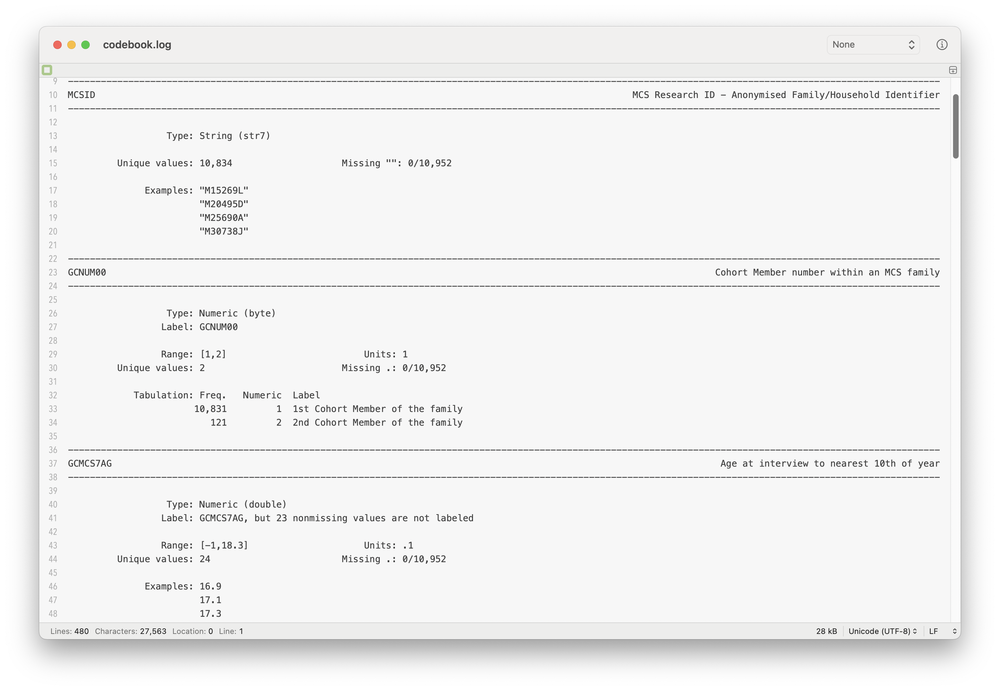

- [Download the Stata script for this
  page](../do_files/mcs-data_discovery.do)

# Introduction

In this section, we show a few `Stata` commands for exploring MCS data;
there’s a lot of data in the MCS, so finding a specific variable can be
challenging. Variables do not generally have names that are descriptive
and there can be some slight changes in naming conventions across
sweeps. (The variable for height in centimeters is `ECHTCMA0` in Sweep 5
but `[A-G]CHTCM00` in other sweeps, for example.) In what follows, we
will use the `Stata` commands to find variables for cohort members’ SDQ,
which has been collected in many of the sweeps.

# `lookfor`

The `lookfor` command allows one to search for variables in a dataset by
keyword. It searches variable names as well as associated metadata.
Below, we read in the MCS 17-year sweep (Sweep 7) CM-level derived data
which contains derived variables (`17y/mcs7_cm_derived.dta`) and use
`lookfor` to search for variables related to the `"SDQ"` (Strengths and
Difficulties Questionnaire).

``` stata
use "17y/mcs7_cm_derived.dta", clear
lookfor "sdq"
```


    Variable      Storage   Display    Value
        name         type    format    label      Variable label
    --------------------------------------------------------------------------------
    GEMOTION_C      byte    %8.0g      GEMOTION_C
                                                  S7 DV Self-reported CM s response
                                                    SDQ Emotional Symptoms
    GCONDUCT_C      byte    %8.0g      GCONDUCT_C
                                                  S7 DV Self-reported CM s response
                                                    SDQ Conduct Problems
    GHYPER_C        byte    %8.0g      GHYPER_C   S7 DV Self-reported CM s response
                                                    SDQ Hyperactivity/Inattention
    GPEER_C         byte    %8.0g      GPEER_C    S7 DV Self-reported CM s response
                                                    SDQ Peer Problems
    GPROSOC_C       byte    %8.0g      GPROSOC_C
                                                  S7 DV Self-reported CM s response
                                                    SDQ Prosocial
    GEBDTOT_C       byte    %8.0g      GEBDTOT_C
                                                  S7 DV Self-reported CM s response
                                                    SDQ Total Difficulties
    GEMOTION        byte    %8.0g      GEMOTION   S7 DV Parent-reported CM SDQ
                                                    Emotional Symptoms
    GCONDUCT        byte    %8.0g      GCONDUCT   S7 DV Parent-reported CM SDQ
                                                    Conduct Problems
    GHYPER          byte    %8.0g      GHYPER     S7 DV Parent-reported CM SDQ
                                                    Hyperactivity/Inattention
    GPEER           byte    %8.0g      GPEER      S7 DV Parent-reported CM SDQ Peer
                                                    Problems
    GPROSOC         byte    %8.0g      GPROSOC    S7 DV Parent-reported CM SDQ
                                                    Prosocial
    GEBDTOT         byte    %8.0g      GEBDTOT    S7 DV Parent-reported CM SDQ Total
                                                    Difficulties

# `codebook`

The MCS datasets that are downloadable from the UK Data Service come
bundled with data dictionaries within the `mrdoc` subfolder. However,
these are limited in some ways. The `codebook` command enables the
creation of data dictionaries. Below we create a codebook for the MCS
17-year sweep dataset (the open dataset), saving it in a log file.

    log using codebook.log, replace
        codebook
    log close



# Create a Lookup Table Across All Datasets

Creating the `lookfor` and `codebook` one dataset at a time does not
allow one to get a quick overview of the variables available in the MCS,
including the sweeps repeatedly measured characteristics are available
in.

Below we create a dataset that contains information on variables within
all the `.dta` files in the MCS folder.

- The code begins by creating a dataset of all of the files in the
  current directory (and subdirectories) which contain the string `.dta`
  (i.e., are Stata datasets). This dataset has one row per file. We
  exclude files from the UKDS subfolder
  (`drop if strmatch(dirname, "*UKDS*")`), as these repeat datasets
  contained in the sweep-specific folders. (As as a reminder, we have
  organised the data files so that each sweep [has its own folder, which
  is named according to the age of
  follow-up](https://cls-data.github.io/docs/mcs-sweep_folders.html)).
- Next, the code loops over each row of the dataset and uses
  `describe *, replace` to create a new dataset containing variable
  names and labels for variables in a given file, with append then used
  to stack the datasets generated from `describe` together in long
  format.
  - `tempfile` creates a temporary file which can be used to save data
    and which deletes the file when the code has finished running. The
    name of the dataset is stored in a `local` macro, with the name
    specified after `tempfile` (here `file_list`). `local` macros can
    then be referenced (i.e., their contents used placing the `` `' ``
    ticks around the macro name).
  - `_N` is an inbuilt variable equal to the number of rows in the data
  - `local ...` creates a local macro.
  - `` forvalues i = 1/`n_files' `` loops over the numbers from 1 to
    `n_files`, where `n_files` is the number of files in the BCS70
    folder. The current value of the loop (1, 2, …, `n_files`) is stored
    in the local macro `i`.
  - `` use ... in `i', clear `` reads in the `i`th row of the dataset
    containing the list of files.
  - `local filename = filename[1]` stores the name of the file in the
    local macro `filename`. The `[1]` indicates that we are taking the
    value from the first row of the dataset (there is only one row in
    the dataset at this point, as we are looping over each file one at a
    time).

<!-- -->

    // ssc install filelist // Uncomment if not already installed
    filelist, pattern("*.dta")
    drop if strmatch(dirname, "*UKDS*")
    tempfile file_list
    save `file_list'

    clear
    tempfile all_vars
    save `all_vars', emptyok

    use `file_list', clear
    local n_files = _N
    forvalues i = 1/`n_files' {
      use `file_list' in `i', clear
      local filename = filename[1]
      local dirname = dirname[1]
      use "`dirname'/`filename'" in 1, clear
      describe *, replace
      gen dir = "`dirname'"
      gen file = "`filename'"
      append using `all_vars'
      save `all_vars', replace
    }

We can use the resulting datasets to search for variables with `"smok"`
or `"cigar"` in their labels.

    // Not printing output to avoid excessive length.
    use `all_vars', clear
    gen name_low = lower(name)
    gen varlab_low = lower(varlab)
    list dir file name varlab if strmatch(varlab_low, "*smok*") | strmatch(varlab_low, "*cigar*")
